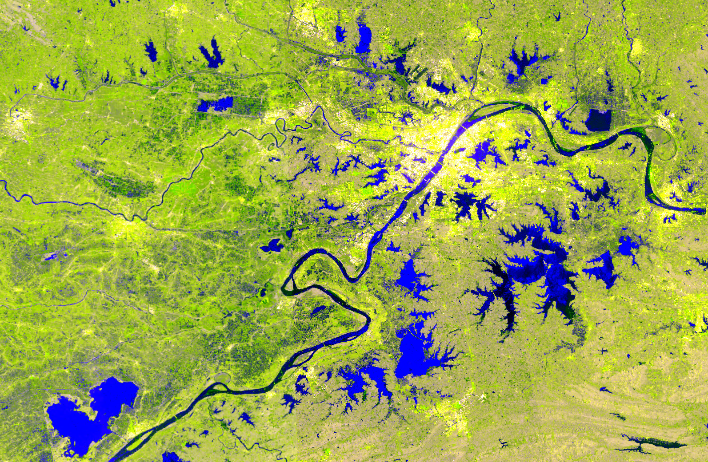
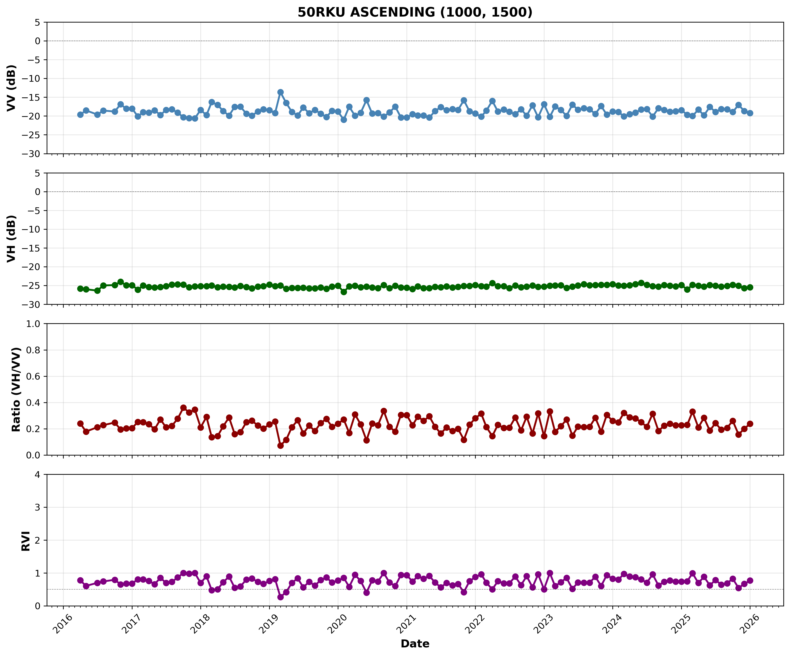

# S1-GRiTS: Sentinel-1 Gridded RTC-gamma0 Monthly Composite Time Series

`s1grits` is the Python package providing the S1-GRiTS core API and processing toolchain.

Sentinel-1 SAR data is voluminous and challenging to turn into analysis-ready time series.
**S1-GRiTS** automates the full pipeline — from ASF OPERA RTC-S1 burst tiles to a spatially
aligned, temporally continuous, multi-year monthly data cube — so researchers can focus on
science rather than data wrangling.

[](https://www.python.org/downloads/)
[](LICENSE)

---

## Quick Start (5 minutes)

### Prerequisites

- Python >= 3.12
- RAM >= 16 GB (>= 64 GB recommended for large regions)
- OS: Windows or Linux
- Network: access to ASF (asf.alaska.edu) and AWS S3

### Step 1 — Install

```bash
# Clone the repository
git clone https://github.com/ottoKae/S1-GRiTS-V100.git
cd S1-GRiTS-V100

# Create conda environment (libmamba solver recommended)
conda install -n base conda-libmamba-solver
conda env create -f environment.yml --solver=libmamba
conda activate py312_s1grits_v100


# Install the s1grits package
pip install .

# Optional: Jupyter kernel for notebook tutorials
python -m ipykernel install --user --name py312_s1grits --display-name "Python (py312_s1grits)"
jupyter lab
```

### Step 2 — Configure

Edit `config/s1grits_config_base_en.yaml`:

```yaml
roi:
  # Mode A: WKT polygon (EPSG:4326) — tiles auto-detected from overlap
  wkt: "POLYGON((113.587 30.0001,114.8881 30.0001,114.8881 30.9441,113.587 30.9441,113.587 30.0001))"

  # Or Mode B: explicit tile list (faster startup, no geometry needed)
  # manual_mgrs_tiles:
  #   - "50RKV"
  #   - "50RLV"

  flight_direction: "ASCENDING"   # ASCENDING | DESCENDING
  polarization: "VV+VH"           # VV+VH | HH+HV

time:
  years: [2024]
  months: [1, 2, 3]   # optional; omit for full year

output:
  base_dir: "./output"
```

### Step 3 — Run

```bash
s1grits process --config config/s1grits_config_base_en.yaml
```

The pipeline automatically handles: ASF search + S3 streaming → multi-burst mosaic per MGRS
tile → median monthly composite → TV despeckle → 4-band output (+ optional GLCM
texture bands) → COG + Zarr + Preview archival.

---

## 1. What is S1-GRiTS?

**S1-GRiTS** (Sentinel-1 **Gri**dded Radiometrically Terrain-Corrected gamma0 Monthly Composite
**T**ime **S**eries) is a production-grade Sentinel-1 SAR processing system that automatically
converts ASF OPERA RTC-S1 burst tiles into a standardised monthly composite time series product.

The final output is an **analysis-ready Sentinel-1 gamma0 time series data cube**, providing
a plug-and-play input for large-scale, long-term land surface change monitoring and classification.

**Core design features:**

1. **End-to-end automated workflow** — users provide only an ROI; the system handles data
   discovery, streaming, grid alignment, despeckle, index calculation and archival;

2. **Cloud-native zero-disk I/O** — data are read directly from ASF Direct S3 Access as byte
   streams, eliminating the traditional download-then-process bottleneck;

3. **MGRS grid alignment** — products aligned to the 100 km x 100 km MGRS standard grid in
   native UTM Zone projections, enabling seamless multi-tile mosaics;

4. **Orbit-direction independent processing** — ASCENDING and DESCENDING data are processed
   and archived separately, preserving incidence-angle and scattering-mechanism consistency;

5. **Standardised gamma0 radiometry** — built on OPERA RTC-S1, radiometrically and
   geometrically corrected, eliminating incidence-angle-induced intensity bias;

6. **Dual speckle suppression** — temporal median compositing + spatial TV Bregman
   filtering, reducing coherent speckle while preserving edge structure;

7. **Standardised multi-band output** — 4 core bands per monthly time slice (extensible with
   GLCM texture bands);

8. **Incremental time series update** — Zarr format supports time-dimension append, enabling
   near-real-time updates without rewriting historical data.

### Typical use cases

Land surface deformation monitoring, agricultural crop classification, forest change detection,
flood disaster assessment, land use / land cover analysis.


**Figure 1.** MGRS-grid mosaic produced by S1-GRiTS, demonstrating spatial consistency and
seamless multi-tile stitching.


**Figure 2.** S1-GRiTS monthly composite product for MGRS tile 50RKV.


**Figure 3.** 2016-2025 Sentinel-1 gamma0 time series and CUSUM-based deforestation
change-point detection produced by S1-GRiTS.

---

## 2. Output Data Products

S1-GRiTS generates **analysis-ready (ARD) time series products** in three formats: COG, Zarr
and Preview PNG.

| Format | Purpose | Key features | Example path |
| :--- | :--- | :--- | :--- |
| **Zarr** | Core scientific product | Multi-dim time cube, incremental append, Dask-parallel | `output/17MPU_ASCENDING/zarr/S1_monthly.zarr` |
| **COG** | GIS visualisation / QC | Cloud-optimised GeoTIFF, one file per month | `output/17MPU_ASCENDING/cog/*.tif` |
| **Preview** | Quick browse | 300 m RGB composite PNG | `output/17MPU_ASCENDING/preview/*.png` |

### 2.1 Band composition

**4 core bands (VV+VH polarisation):**

| Band | Name | Description |
| :--- | :--- | :--- |
| Band 1 | `VV_dB` | Co-polarisation gamma0 backscatter (dB) |
| Band 2 | `VH_dB` | Cross-polarisation gamma0 backscatter (dB) |
| Band 3 | `Ratio` | Cross-polarisation ratio VH/VV (linear) |
| Band 4 | `RVI` | Radar Vegetation Index = 4*VH / (VV+VH), theoretical range [0, 4] |

> For **HH+HV polarisation**, bands 1/2 map to `HH_dB` / `HV_dB`; Ratio and RVI definitions
> are unchanged.

**Optional GLCM texture bands (appended after core bands when enabled):**

Each enabled dB band (`VV_dB` and/or `VH_dB`) can produce the following texture metrics:
`contrast`, `homogeneity`, `entropy`, `correlation`. Band naming: `{VV|VH}_glcm_{metric}`,
e.g. `VV_glcm_contrast`, `VH_glcm_entropy`. When enabled with both input bands and all 4
metrics, total band count = 4 + 2*4 = **12 bands**.

### 2.2 Cloud-Optimised GeoTIFF (COG)

- **Spatial resolution**: 30 m
- **Spatial unit**: single MGRS tile (100 km x 100 km), UTM Zone projection
- **Temporal unit**: one file per calendar month
- **Naming convention**:

```text
output/{MGRS_TILE}_{DIRECTION}/cog/{MGRS_TILE}_S1_Monthly_{DIRECTION}_{YYYY-MM}.tif
```

### 2.3 Zarr time series data cube (core product)

- **Data structure**: `(band, time, y, x)` 4-D cube
- **Spatial resolution**: 30 m
- **Temporal extent**: multi-year monthly series; supports incremental append
- **Chunking**: `1024 x 1024` (y x x), enabling Dask parallel reads
- **Zarr variables**: `VV_dB`, `VH_dB`, `Ratio`, `RVI` (+ optional GLCM texture bands)
  \+ `time`, `x`, `y` coordinates
- **Naming convention**:

```text
output/{MGRS_TILE}_{DIRECTION}/zarr/S1_monthly.zarr
```

### 2.4 Preview PNG (quick browse)

- **Spatial resolution**: 300 m (10x downsampled from 30 m)
- **RGB composite**: R = VV_dB, G = VH_dB, B = Ratio
- **Naming convention**:

```text
output/{MGRS_TILE}_{DIRECTION}/preview/{MGRS_TILE}_S1_Monthly_{DIRECTION}_{YYYY-MM}.png
```

### 2.5 Two-level catalog index

Two-level Parquet catalogs maintain all product metadata automatically:

**Tile-level catalog:**

```text
output/{MGRS_TILE}_{DIRECTION}/catalog.parquet
```

**Global catalog:**

```text
output/catalog.parquet
```

### 2.6 STAC metadata

S1-GRiTS auto-generates **STAC 1.1.0**-compliant Item JSON and Collection JSON, kept in sync
with `catalog.parquet` at all times.

- **Standard**: STAC 1.1.0 + Datacube extension v2.3.0
- **Collection ID**: `s1-grits-monthly`
- **Item files**: one `{tile}_{direction}_{YYYY-MM}.json` per monthly composite, stored in the
  corresponding tile directory
- **Collection file**: `output/collection.json`

STAC files are rebuilt automatically during `catalog rebuild`.

### 2.7 Full directory structure

```text
output/
+-- catalog.parquet                          # global metadata index
+-- collection.json                          # STAC Collection
|
+-- 17MPU_ASCENDING/                         # tile + orbit direction
|   +-- 17MPU_ASCENDING_2024-01.json         # STAC Item JSON
|   +-- 17MPU_ASCENDING_2024-02.json
|   |
|   +-- cog/                                 # COG files
|   |   +-- 17MPU_S1_Monthly_ASCENDING_2024-01.tif
|   |   +-- 17MPU_S1_Monthly_ASCENDING_2024-02.tif
|   |   +-- ...
|   |
|   +-- zarr/                                # Zarr time series cube
|   |   +-- S1_monthly.zarr/
|   |       +-- VV_dB/   (time, y, x)
|   |       +-- VH_dB/   (time, y, x)
|   |       +-- Ratio/   (time, y, x)
|   |       +-- RVI/     (time, y, x)
|   |       +-- time/
|   |       +-- x/
|   |       +-- y/
|   |
|   +-- preview/                             # 300 m preview PNGs
|   |   +-- 17MPU_S1_Monthly_ASCENDING_2024-01.png
|   |   +-- ...
|   |
|   +-- catalog.parquet                      # tile-level catalog
|
+-- 17MPU_DESCENDING/                        # descending-orbit data (independent directory)
    +-- ...
```

---

## 3. Configuration Reference

The `config/` directory provides a ready-to-use English template:

| File | Description |
| :--- | :--- |
| `s1grits_config_base_en.yaml` | Full configuration with English comments |

### 3.1 ROI configuration

Two modes are supported; choose one in the YAML:

#### Mode A: WKT polygon (tiles auto-detected)

The system calculates all MGRS tiles that intersect the polygon. Coordinates are EPSG:4326.
Recommended source: [ASF Vertex](https://search.asf.alaska.edu) or [geojson.io](https://geojson.io).

```yaml
roi:
  wkt: "POLYGON((113.587 30.0001,114.8881 30.0001,114.8881 30.9441,113.587 30.9441,113.587 30.0001))"
  flight_direction: "ASCENDING"   # ASCENDING | DESCENDING
  polarization: "VV+VH"           # VV+VH | HH+HV
```

#### Mode B: Manual MGRS tile list (precise control, faster startup)

```yaml
roi:
  manual_mgrs_tiles:
    - "50RKV"
    - "50RLV"
  flight_direction: "ASCENDING"   # ASCENDING | DESCENDING
  polarization: "VV+VH"           # VV+VH | HH+HV
```

**Orbit direction note:** ASCENDING and DESCENDING are processed and archived independently;
output directory names include the direction suffix (e.g. `17MPU_ASCENDING`). Run the config
twice with different `flight_direction` values to produce both directions.

### 3.2 Time range configuration

Two modes are supported:

#### Mode A: Specific years (recommended)

```yaml
time:
  years: [2024, 2025]    # single or multiple years
  months: [6, 7, 8]      # optional: omit for all 12 months
```

#### Mode B: Full archive (auto-detect earliest available data)

```yaml
time:
  full: 2026    # process from earliest available data (~2014) through end of 2026
```

#### Future-month guard

The system checks every requested month before issuing any ASF search.
**No config change needed** — future/incomplete months are skipped automatically with a
terminal WARNING:

| Month type | Condition | Behaviour |
| :--- | :--- | :--- |
| Past month | `(year, month) < (today.year, today.month)` | Processed normally |
| Current month (incomplete) | `year == today.year AND month == today.month` | Skipped + WARNING |
| Future month | `(year, month) > (today.year, today.month)` | Skipped + WARNING |

**Example** (today = 2026-04-14, config `years: [2026], months: [3, 4, 5]`):

```text
WARNING  Skipping 2026-04: month is current (incomplete) or future (today is 2026-04-14)
WARNING  Skipping 2026-05: month is current (incomplete) or future (today is 2026-04-14)
```

Processing continues with 2026-03. If all months for a year are skipped, that year is silently
skipped; remaining years proceed normally.

In `full` mode, the end date is automatically clipped to the last fully completed month:

```text
WARNING  Clipping end date from 2026-12-31 to 2026-03-31 (last fully completed month; today is 2026-04-14)
```

### 3.3 Output configuration

```yaml
output:
  base_dir: "./output"   # output root (subdirectory structure created automatically)
  overwrite: false       # false: skip months that already have output (safe for incremental runs)
                         # true:  re-process and replace existing COG, Zarr slice, and Preview
  formats:
    cog: true            # generate COG files
    preview: true        # generate Preview PNGs
                         # Note: Zarr is always written (cannot be disabled)
```

### 3.4 Parallel and memory configuration

```yaml
parallel:
  enabled: true
  max_workers: 4         # concurrent MGRS tiles
                         # <= 16 GB RAM: 2  |  32 GB: 4  |  >= 64 GB: 6-8

memory:
  max_memory_gb: 'auto'  # 'auto' = auto-detect  |  number = manual override (GB)
  batch_strategy: 'auto' # auto | yearly | quarterly | monthly
  max_download_workers: 2
  scene_retry_timeout_seconds: 600   # per-scene retry budget (seconds)
  batch_max_retries: 2               # batch-level retry count
  max_failed_ratio: 0.0              # max allowed failed scene fraction (0 = zero tolerance)
  clear_cache_per_batch: true
```

### 3.5 Processing configuration

```yaml
processing:
  post_processing: true  # true  = hARDCp: monthly composite + TV despeckle + Ratio/RVI
                         # false = ARDC:   monthly composite only, no despeckle
  target_crs: null       # null = auto-derive UTM Zone from MGRS tile (recommended)
  target_resolution: 30.0
  use_roi_mask: false
  mosaic_strategy: "mean"
  trim_fraction: 0.15    # trimmed-mean clip fraction

  despeckle:
    monthly_despeckle: true
    method: "tv_bregman"
    kwargs:
      reg_param: 5.0     # TV regularisation strength (higher = smoother)

  # Optional GLCM texture features (disabled by default)
  texture_features:
    enabled: false        # set true to enable texture band generation
    inputs: ["VV_dB", "VH_dB"]
    metrics: ["contrast", "homogeneity", "entropy", "correlation"]
    window_size: 5        # sliding window size (odd number)
    distance: 1           # GLCM pixel-pair distance
    angles: [0, 90]       # directions (results averaged)
    average_angles: true
    levels: 16            # quantisation levels (16 or 32)
    vv_db_range: [-25, 5]
    vh_db_range: [-32, -5]

  zarr_time_fix:
    enabled: true         # auto-fix time-dimension ordering after processing
    create_backup: true   # create backup before fix (recommended)
    backup_dir: null      # null = timestamped backup next to original
```

---

## 4. CLI Command Reference

`s1grits` provides 6 commands covering the full processing-to-operations workflow:

| Command | Subcommand | Purpose |
| :--- | :--- | :--- |
| `process` | — | Run the full processing workflow |
| `catalog` | `rebuild` | Rebuild catalog from COG files; sync STAC |
| `catalog` | `validate` | Validate catalog schema and STAC Item alignment |
| `catalog` | `inspect` | Show global coverage summary for all tiles |
| `tile` | `inspect` | Show temporal completeness detail for a single MGRS tile |
| `mosaic` | — | Create multi-tile mosaic (VRT or COG) |

### 4.1 Help

```bash
s1grits --help
s1grits catalog --help
s1grits mosaic --help
```

### 4.2 Run processing workflow

```bash
s1grits process --config config/s1grits_config_base_en.yaml
```

### 4.3 Catalog management

`catalog rebuild` simultaneously rebuilds `catalog.parquet`, all STAC Item JSON files and
`collection.json`, keeping all three in sync.

```bash
# Rebuild catalog (use after interruption or manual file edits)
s1grits catalog rebuild --output-dir ./output

# Validate catalog schema and STAC Item alignment
s1grits catalog validate --output-dir ./output

# Show global coverage summary for all tiles
s1grits catalog inspect --output-dir ./output
```

`catalog inspect` example output:

```text
Tile       Direction    Months  Expected  Missing  Complete  Range
50RKV      ASCENDING        24        24        0   100.0%   2024-01 ~ 2025-12
50RKU      ASCENDING        22        24        2    91.7%   2024-01 ~ 2025-12
```

### 4.4 Single-tile time series inspection

```bash
# Show missing months and COG file status for all directions of a tile
s1grits tile inspect --tile 50RKV --output-dir ./output

# Filter by orbit direction (recommended when both ASCENDING and DESCENDING exist)
s1grits tile inspect --tile 50RKV --direction ASCENDING --output-dir ./output
s1grits tile inspect --tile 50RKV --direction DESCENDING --output-dir ./output
```

`--direction` is optional:

- Omit: show all orbit directions for the tile
- Specify: show only that direction (title bar shows tile ID + direction)

Example output (with `--direction ASCENDING`):

```text
------------------------------------------------------------ Tile: 50RKV  |  ASCENDING ------------------------------------------------------------

ASCENDING
  Present months:  22
  Expected months: 24
  Date range:      2024-01 ~ 2025-12
  Completeness:    91.7%

  Missing months (2):
    - 2024-03  (no source data)
    - 2025-08  (COG exists but missing from catalog -- run rebuild)
```

### 4.5 Multi-tile mosaic

```bash
# Default: EPSG:4326, VRT format
s1grits mosaic --month 2024-01 --direction ASCENDING --output-dir ./output

# Specify projection
s1grits mosaic --month 2024-01 --direction ASCENDING --crs EPSG:3857

# Keep native UTM projection (precise measurements / area calculations)
s1grits mosaic --month 2024-01 --direction ASCENDING --keep-utm

# Output as physical COG file (suitable for distribution)
s1grits mosaic --month 2024-01 --direction ASCENDING --format COG

# Merge both directions (ASCENDING primary, DESCENDING fills NoData)
s1grits mosaic --month 2024-01 --direction ALL

# Filter tiles by MGRS prefix (e.g. 50R zone only)
s1grits mosaic --month 2024-01 --direction ASCENDING --mgrs-prefix 50R

# Specify mosaic output directory
s1grits mosaic --month 2024-01 --direction ASCENDING --output ./results/mosaic/
```

**Format and projection options:**

| Parameter | Description |
| :--- | :--- |
| `--format VRT` | Virtual mosaic, no extra disk usage (default; suitable for local analysis) |
| `--format COG` | Physical mosaic GeoTIFF (suitable for distribution) |
| `--crs EPSG:4326` | Reproject to WGS84 (default; suitable for wide-area visualisation) |
| `--crs EPSG:3857` | Reproject to Web Mercator (suitable for web map services) |
| `--keep-utm` | Preserve original UTM projection, skip reprojection |

---

## 5. Jupyter Notebook Tutorials

```bash
# Activate environment and start Jupyter
conda activate py312_s1grits
jupyter notebook
```

Example notebooks in `notebooks/`:

| File | Content |
| :--- | :--- |
| `Tutorial_A01_asf_search_basics.ipynb` | ASF search basics and data discovery |
| `Tutorial_A02_S1-GRiTS_Guideline.ipynb` | S1-GRiTS CLI workflow walkthrough |
| `Tutorial_A03_shapefile_wkt_query_en.ipynb` | Shapefile to WKT polygon query |
| `Tutorial_B01_S1-GRiTS_mosaicVisual_Fig3.ipynb` | Monthly composite visualisation |
| `Tutorial_B02_S1-GRiTS_mosaicVisual_Fig4(*.ipynb` | Regional mosaic figure generation |
| `Tutorial_B03_S1-GRiTS_timeseries_Fig5.ipynb` | Time series analysis and plotting |

---

## 6. FAQ

**Q: Why are ascending and descending orbits processed separately?**

A: Different orbit directions correspond to different incidence angles and observation
geometries. Mixing them introduces systematic bias. Run the config twice with
`flight_direction: "ASCENDING"` and `flight_direction: "DESCENDING"` respectively.

**Q: What is the difference between Zarr and COG?**

A: Zarr is the core scientific product — it supports time-dimension slicing, incremental
append and Dask-parallel computation, making it suitable for long time series analysis. COG
is one file per month, suitable for direct loading in QGIS and other GIS tools. COGs can be
regenerated from Zarr, but Zarr cannot be recovered from COGs.

**Q: What does `max_failed_ratio: 0.0` mean?**

A: Zero-tolerance mode — any scene download or processing failure aborts the run with an
error. Set to `0.1` (allow up to 10% failure rate) for more lenient behaviour.

**Q: How many extra bands does GLCM add?**

A: The default configuration (`inputs: ["VV_dB", "VH_dB"]`,
`metrics: ["contrast", "homogeneity", "entropy", "correlation"]`) adds 8 texture bands,
bringing the total to 4 + 8 = **12 bands**.

**Q: What SAR index conventions does S1-GRiTS use?**

A: Ratio = VH / VV (linear). RVI = 4 * VH / (VV + VH), theoretical range [0, 4].
Both are standard conventions in SAR remote sensing literature for Sentinel-1.

---

## 7. License

Copyright 2026 KaeRao

Licensed under the Apache License, Version 2.0. See [LICENSE](LICENSE) for full text.

---

## 8. Citation

If you use S1-GRiTS in your research, please cite this repository:

```text
KaeRao. S1-GRiTS: Sentinel-1 Gridded Backscatter γ⁰ Monthly Composite Time Series.
GitHub: https://github.com/ottoKae/S1-GRiTS-V100, 2026.

A companion paper is currently under review and will be released upon publication.
```

---

## 9. Acknowledgements

**[@ottoKae](https://github.com/ottoKae)** designed and planned the entire project, conducted all real-world testing and validation, ensured end-user usability, and performed quality assurance of all deliverables.

The burst-to-MGRS-tile enumeration and spatial speckle filtering approaches draw heavily from the [dist-s1-enumerator](https://github.com/opera-adt/dist-s1-enumerator) project by OPERA/JPL. We gratefully acknowledge their work.

Code optimization and the production-ready implementation were carried out with assistance from [@claude](https://claude.ai) (Anthropic).
